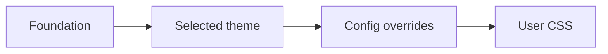

# Component Gallery

This page puts common article elements next to one another. It is linked from
several notes, so a backlinks section should appear below the content.

# Typography and rhythm
## Typography and rhythm

This page puts common article elements next to one another. It is linked from
several notes, so a backlinks section should appear below the content.

## Typography and rhythm

Body copy should remain comfortable over several lines. **Bold text** needs
clear emphasis, *italic text* needs a distinct voice, and `inline code` should
sit naturally on the baseline. Visit the [[notes/connections|connected note]]
or return to [[The Theme Garden|the garden entrance]].

### A third-level heading

The heading scale should remain obvious without overwhelming short notes.

#### A fourth-level heading

Small headings still need enough weight and spacing to divide nearby ideas.

## Lists and tasks

1. Establish the reading rhythm.
2. Compare component treatments.
3. Check the same page in dark mode.

- [x] Render the article shell
- [x] Generate search and graph data
- [ ] Review the next theme

## Quotation

> Good design makes the relationships between things visible.
>
> A second paragraph checks spacing within the same quotation.

## Data table

| Surface | Quiet theme | Expressive theme | Narrow viewport |
|---|---:|---:|---:|
| Article width | 42rem | 54rem | fluid |
| Corner radius | 0–4px | 16–28px | reduced |
| Elevation | none | layered shadows | restrained |
| Navigation | linear | floating surface | wrapped |

## Code

Inline `theme.preset` is followed by a highlighted block:

```go
type Theme struct {
	Name     string
	Defaults map[string]string
}

func Select(name string) Theme {
	return registry[name]
}
```

And a plain-text block checks the unhighlighted treatment:

```
base -> selected theme -> config -> user CSS
```

## Media and diagrams




## Rule and closing link

---

Continue to the [[notes/callouts|callout conservatory]].
