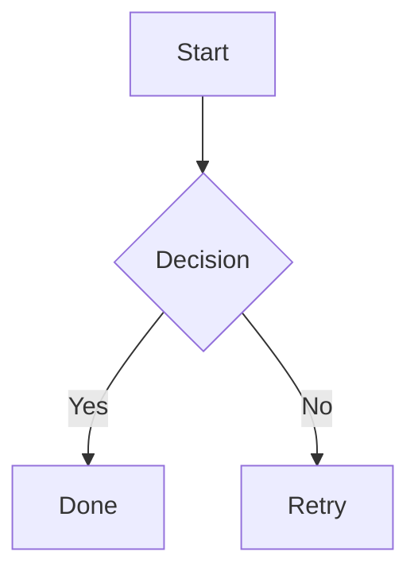

Create pages using Markdown files with YAML frontmatter.

## Creating Pages

### Using the CLI

```bash
leafpress new "My First Note"
```

Creates `my-first-note.md` with frontmatter.

### Manually

Create any `.md` file in your site directory:

```markdown
---
title: "My First Note"
date: 2025-01-06
tags: [ideas, projects]
---

Your content here.
```

### Page filenames and URLs

A page's URL comes from its path: `notes/éclair.md` publishes at
`/notes/éclair/`. Letters (including Unicode), numbers, hyphens, underscores,
and dots are kept as written, including their case. Each run of spaces or other
characters becomes a single hyphen, or is dropped at the start or end of a name,
and trailing dots are removed. `Field Notes/Q&A (draft).md` publishes at
`/Field-Notes/Q-A-draft/`. Folder names follow the same rule.

Set `slug` in frontmatter to choose the page's URL name yourself. The folder
still decides the section:

```markdown
---
slug: first-note
---
```

With this frontmatter, `notes/My Note.md` publishes at `/notes/first-note/`. A
frontmatter slug must already be URL-safe (`My-Note`, not `My Note`) and cannot
contain slashes. Section and home index pages take their URL from their folder,
so they do not accept `slug`.

If two pages would share a URL, the build stops and names both files. This
includes cleaned names that meet, such as `My Note.md` and `My-Note.md`, and
URLs that differ only in letter case, such as `Notes.md` beside a `notes/`
folder, because case-insensitive filesystems and hosts cannot keep them apart.
Rename one or give it a different `slug`. Windows device names such as `CON`,
`NUL`, or `COM1` are also rejected as page and folder names.

## Frontmatter

All fields are optional:

- `title` — Page title (falls back to a title generated from the filename; an untitled home page uses the site title)
- `slug` — URL name for the page, replacing the name derived from its filename (see [Page filenames and URLs](#page-filenames-and-urls))
- `date` — Publication date (YYYY-MM-DD)
- `modified` — Last modified date
- `tags` — List of tags: `[tag1, tag2]`
- `growth` — Note maturity: `seedling`, `budding`, or `evergreen`
- `toc` — Override global TOC setting: `true` or `false`
- `description` — SEO meta description (auto-generated from content if omitted)
- `image` — OG image path for social sharing
- `draft` — Set `true` to exclude from build
- `readingTime` — Override calculated reading time (minutes)

### Obsidian-compatible aliases

- `created`, `createdAt` — Aliases for `date`
- `updated`, `updatedAt` — Aliases for `modified`

### Section index pages (`_index.md`)

- `sort` — Sort order for the section's page list: `date` (default), `title`, or `growth`
- `showList` — Set `false` to hide the page list on a section index (default `true`)

## Markdown Features

### Standard Markdown

All CommonMark syntax works: headings, bold, italic, lists, links, images, code blocks.

### Wiki Links

Connect pages with double brackets:

```markdown
[[other-page]]
[[other-page|Custom text]]
[[folder/nested-page]]
```

See [[guide/wiki-links|Wiki Links]] for details.

### Tags

Tags can be declared in frontmatter or written directly in ordinary prose:

```markdown
---
tags: [projects]
---

Working on #leafpress and #static-sites.
```

Inline tags become links to their generated tag pages. Leafpress merges them
with frontmatter tags, preserving the frontmatter spelling and removing
case-insensitive duplicates.

Tag names may contain letters, numbers, underscores, and hyphens. Hashes in
code spans, fenced code blocks, links, URLs, raw HTML tags, or escaped forms
such as `\#literal` remain literal. Nested forms such as `#project/leafpress`
are not interpreted as tags.

### Callouts

Obsidian-compatible admonitions:

```markdown
> [!note]
> This is a note callout.

> [!warning] Custom Title
> Warning with a custom title.
```

Available types (with common Obsidian aliases):

| Type | Aliases |
|------|---------|
| `note` | |
| `info` | |
| `tip` | `hint` |
| `important` | |
| `warning` | `caution` |
| `danger` | `error` |
| `success` | `check`, `done` |
| `failure` | `fail` |
| `question` | `faq` |
| `abstract` | `summary`, `tldr` |
| `example` | |
| `quote` | |
| `todo` | |
| `bug` | |

Unknown types still render with a default icon and a title-cased label.

### Images

Standard markdown images:

```markdown

```

Obsidian-style embeds also work:

```markdown
![[photo.jpg]]
![[photo.jpg|Alt text]]
![[photo.jpg|500]]
```

The pipe value is treated as width if numeric, alt text otherwise. Images in `static/images/` are copied to the output.

### Video & Audio

Embed local media with Obsidian syntax:

```markdown
![[demo.mp4]]
![[recording.mp3]]
![[static/video/intro.webm]]
```

Supported formats: `.mp4`, `.webm`, `.ogv`, `.mov` (video) and `.mp3`, `.wav`, `.ogg`, `.m4a`, `.flac` (audio). Bare filenames resolve by media type — video under `static/video/`, audio under `static/audio/` (and images under `static/images/`). Paths that already contain a `/` are used as-is (with a leading slash).

### YouTube Embeds

Paste a YouTube URL on its own line:

```markdown
https://www.youtube.com/watch?v=dQw4w9WgXcQ
```

It auto-converts to a responsive embedded player. Links inline with other text are not affected.

### Mermaid Diagrams

Fenced code blocks with `mermaid` language render as diagrams:

````markdown

````

Supports all Mermaid diagram types: flowcharts, sequence diagrams, Gantt charts, class diagrams, and more. The Mermaid runtime is **self-hosted** under `static/leafpress/mermaid/` (no CDN) and is only written into the site when a page actually contains a diagram.

### Code Blocks

Fenced code blocks with syntax highlighting:

````markdown
```javascript
function hello() {
  console.log("Hello, world!");
}
```
````

Copy button appears on hover.

### Footnotes

Add references with `[^name]` and define them anywhere in the file:

```markdown
This needs a source[^1]. Another claim[^note].

[^1]: Source: Wikipedia, 2026.
[^note]: This supports **bold**, `code`, and [links](https://example.com).
```

Footnotes render as superscript numbers linking to a footnote section at the bottom of the page. Named footnotes are auto-numbered.

## Folders

Organize content in folders under your site root. Create `folder/_index.md` for section pages:

```
.
├── index.md
├── projects/
│   ├── _index.md      # /projects/
│   ├── website.md     # /projects/website/
│   └── cli.md         # /projects/cli/
└── notes/
    └── ideas.md       # /notes/ideas/
```

Link to nested pages: `[[projects/website]]`
